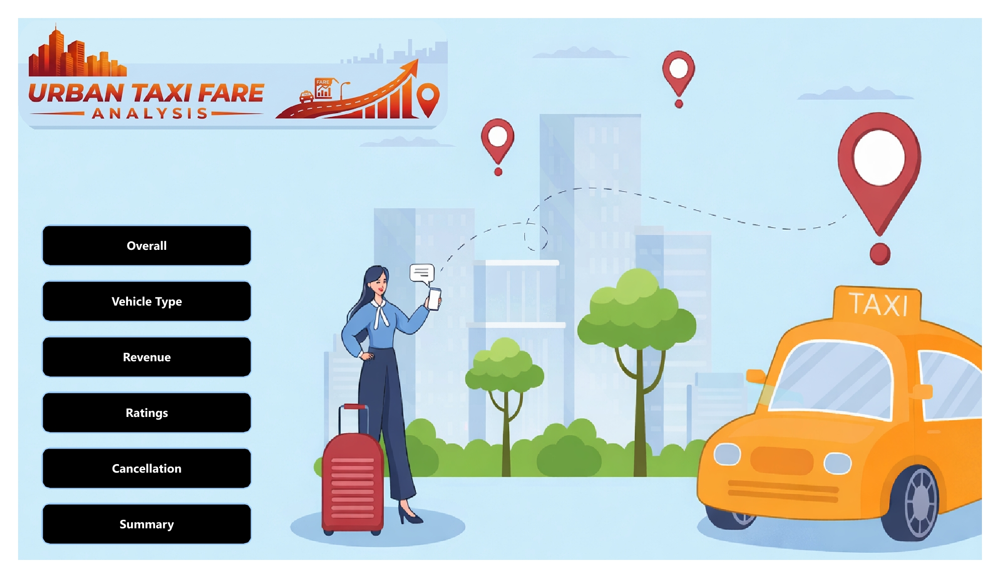
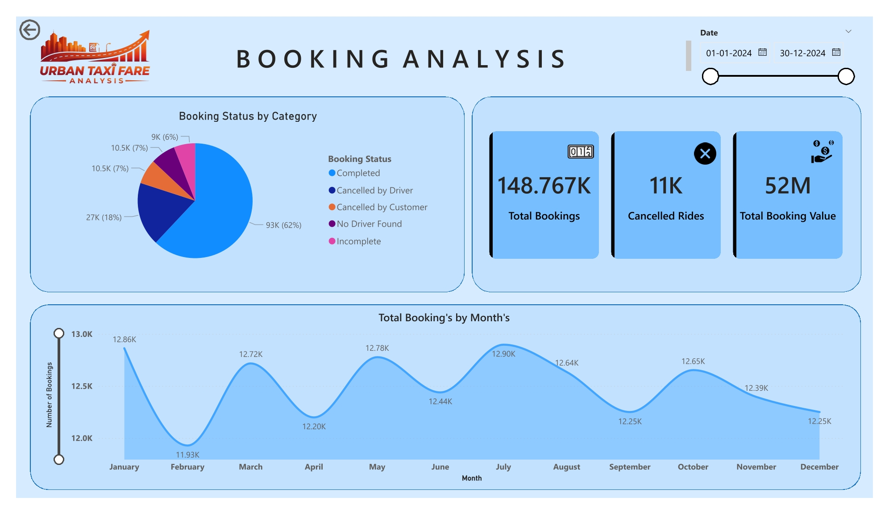
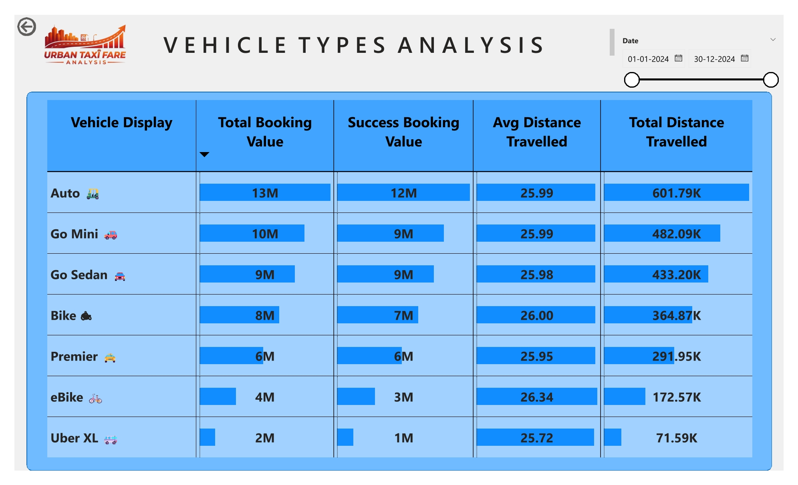
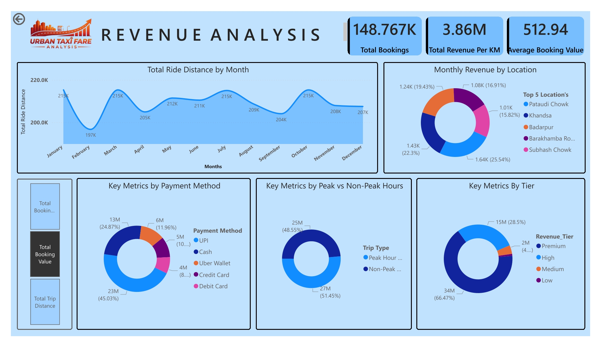
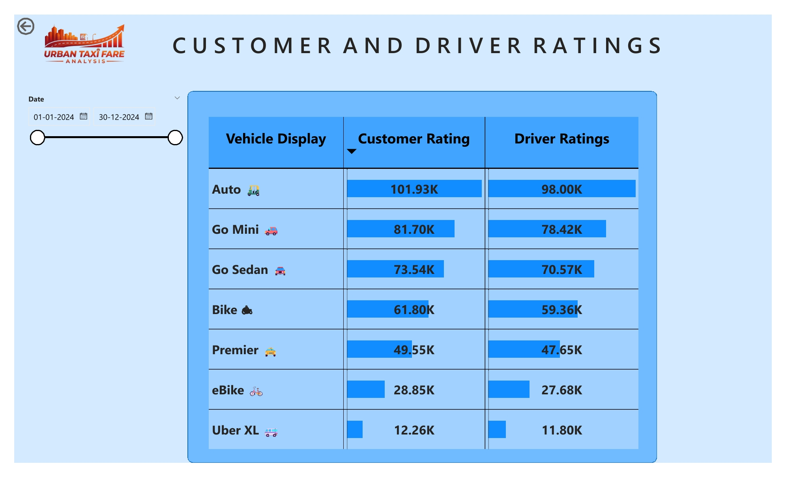
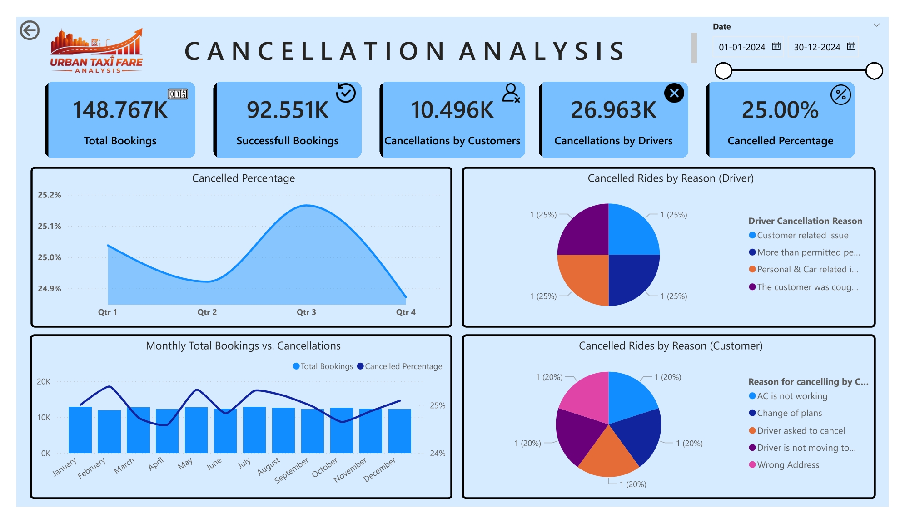
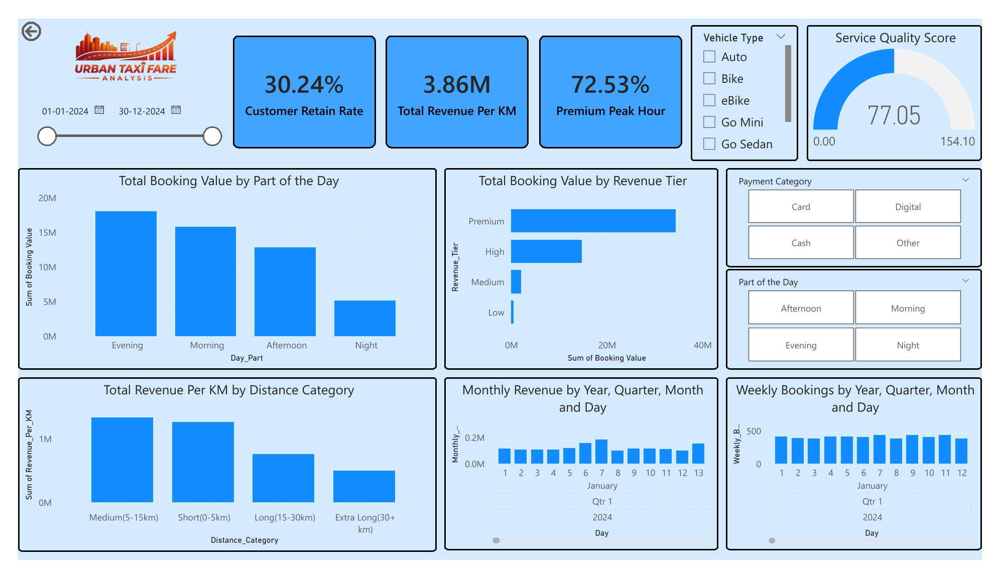

# 🚖 Urban Taxi Fare Analysis Dashboard

## 📊 Project Overview

This project presents a **comprehensive Power BI dashboard** for analyzing taxi operations, focusing on:

* 📈 Booking trends
* 💰 Revenue insights
* 🚗 Vehicle performance
* ⭐ Customer & driver ratings
* ❌ Cancellation patterns

The goal is to transform raw ride data into **clear, actionable insights** for better decision-making.

---

## 🎯 Key Objectives

* Understand booking and revenue trends over time
* Identify factors affecting cancellations
* Compare performance across vehicle types
* Analyze customer and driver satisfaction
* Evaluate revenue distribution and efficiency

---

## 🧩 Dashboard Pages

---

### 🏠 1. Home Page

Provides navigation to all sections of the dashboard.

---

### 📊 2. Booking Analysis

* Total bookings overview
* Booking status distribution
* Monthly booking trends

---

### 🚗 3. Vehicle Type Analysis

* Performance by vehicle category
* Booking value and distance comparison
* Average ride distance insights

---

### 💰 4. Revenue Analysis

* Total revenue and revenue per KM
* Revenue by location and payment method
* Peak vs non-peak performance

---

### ⭐ 5. Customer & Driver Ratings

* Rating comparison across vehicle types
* Customer vs driver satisfaction trends

---

### ❌ 6. Cancellation Analysis

* Cancellation percentage trends
* Customer vs driver cancellations
* Reasons for cancellations

---

### 📌 7. Advanced Summary

* Retention rate
* Service quality score
* Revenue and booking patterns

---

## 🛠️ Tools & Technologies

* **Power BI** – Data visualization
* **DAX** – Calculated measures
* **Excel / CSV** – Data source

---

## 💡 Key Insights

* 📉 Cancellation rates remain relatively stable but vary across time
* 🚗 Certain vehicle types generate higher revenue
* 💳 Digital payments dominate booking transactions
* ⭐ Customer ratings are slightly higher than driver ratings
* ⏰ Peak hours contribute significantly to total revenue

---

## 🚀 How to Use

1. Open the `.pbix` file in Power BI
2. Use slicers (Date, Vehicle Type, etc.) to filter data
3. Navigate between pages using the menu

---

## 📌 Note

All dashboard images are included for preview.
For full interactivity, use the Power BI file.

---

## 🙌 Author

**Ketan Arote**

---
